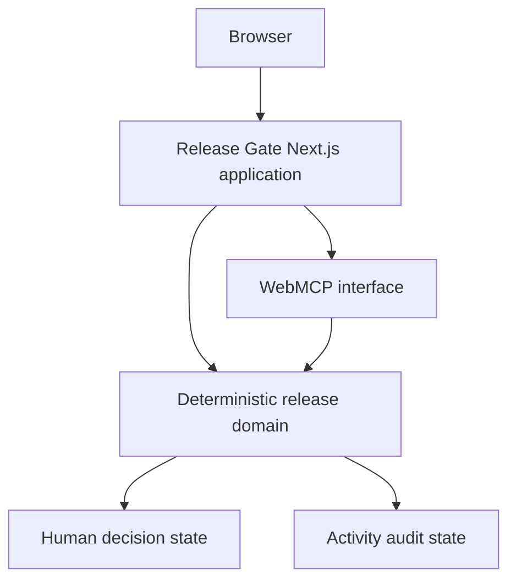

# Release Gate

Agent-native software release decisions with human control.

Release Gate exposes structured software-release evidence and controlled release decisions to browser agents through WebMCP.

The system computes deterministic release recommendations from CI, tests, security, and change-risk evidence while preserving explicit human authority over final release decisions.

## Why Release Gate

Software release decisions are fragmented across:

- CI
- automated tests
- security findings
- change risk
- human judgment

Agents can inspect this information, but production release authority should not silently become agent authority.

Release Gate demonstrates an agent-native release decision workflow:

```text
Evidence → System Recommendation → Human Authority → Audit
```

## What it does

Release Gate:

- discovers deterministic synthetic releases
- exposes release evidence through WebMCP
- calculates deterministic release recommendations
- supports `GO`, `CONDITIONAL_GO`, and `NO_GO`
- separates system recommendation from final human decision
- supports explicit human approval and rejection
- prevents approval of hard-blocked `NO_GO` releases
- records auditable human decision activity and blocked approval attempts

Current data is deterministic synthetic demo data. Release Gate does not include real GitHub, CI provider, security scanner, deployment, database, or LLM integrations.

## WebMCP

Release Gate exposes browser-native structured capabilities using WebMCP.

### Tool catalog

Discovery:

- `list_releases`
- `get_release`

Evidence:

- `get_ci_status`
- `get_test_results`
- `get_security_findings`
- `get_change_risk`

Intelligence:

- `analyze_release`

Human decision:

- `approve_release`
- `reject_release`
- `get_final_decision`

Audit:

- `get_activity_log`

The catalog contains exactly 11 tools: 9 read-only tools and 2 write tools.

### Safety model

- `analyze_release` is read-only.
- `approve_release` and `reject_release` are explicit write operations.
- `approve_release` requires explicit human acknowledgement.
- `NO_GO` cannot be overridden by approval.
- System recommendation does not equal human final decision.
- Unknown releases return `RELEASE_NOT_FOUND`.
- Write operations are reflected in the activity audit trail.

## Demo releases

| Version | Release ID | Recommendation | Risk | Evidence summary |
| --- | --- | --- | --- | --- |
| `2.4.0` | `release-240` | `GO` | `LOW` | Passing CI, passing tests, passing security gate, low change risk. |
| `2.5.0` | `release-250` | `CONDITIONAL_GO` | `MEDIUM` | Passing CI with flaky tests, one medium security finding, payment-sensitive medium-risk changes. |
| `2.6.0` | `release-260` | `NO_GO` | `HIGH` | Failed CI, failed tests, high-severity security findings, broad high-risk changes. |

## Architecture

High-level flow:



Release Gate is intentionally scoped to a browser-based demo application with deterministic release evidence, local demo decision state, and a WebMCP interface.

## Local development

Install dependencies:

```bash
npm install
```

Start the development server:

```bash
npm run dev
```

Open the local URL printed by Next.js. By default this is usually:

```text
http://localhost:3000
```

## Quality gates

Run:

```bash
npm run test
npm run lint
npm run build
```

Current validated result: 52 automated tests passing, lint passing, and production build passing.

## Browser requirements

The Release Gate UI runs as a Next.js browser application. WebMCP tool registration requires a WebMCP-compatible browser/runtime, such as the Chrome-based WebMCP development environment used by challenge tooling.

In a standard browser without WebMCP support, the UI can still be viewed, but browser-agent tool capabilities are not exposed by the runtime.

## Project status

Hackathon / reference implementation.

Release Gate is intentionally scoped to deterministic synthetic release evidence. Possible real-world integrations, such as CI providers, source control systems, deployment systems, identity, databases, or security scanners, are future work and are not part of the current implementation.

## Additional documentation

- [OpenAI WebMCP Challenge notes](HACKATHON.md)
- [Agent evaluation scenarios](AGENT_EVALS.md)
- [Demo script](DEMO.md)

## License

Released under the [MIT License](LICENSE).
