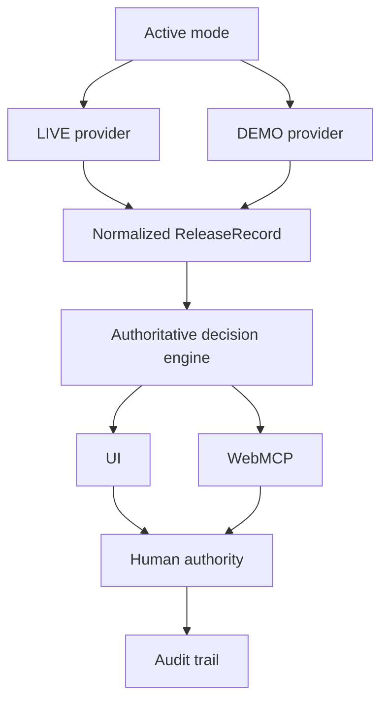

# Release Gate

Agent-native software release decisions with human control.

Release Gate exposes software-release evidence and controlled release decisions to browser agents through WebMCP. The system computes deterministic release recommendations from CI, tests, dependency security, and change-risk evidence while preserving explicit human authority over final release decisions.

## Evidence modes

Release Gate has exactly two explicit evidence modes:

### LIVE

Real evidence from the public repository:

- Repository: `JankoD84/release-gate`
- Branch: `main`
- Evidence source: GitHub Actions

LIVE mode evaluates the current `main` commit using a commit-specific release ID such as `live-6dcdc4ca80ae510f2e7f9727d814ca31b27a0180`. Human decisions are keyed to that exact SHA, so approval for one commit does not carry to another commit.

LIVE currently measures:

- `npm run test` test results parsed from the Node test runner output
- required CI gate outcomes for tests, lint, and build
- dependency security evidence from `npm audit --json`
- Git change surface from the evaluated commit range

LIVE does **not** claim arbitrary repository support, GitHub App installation, GitHub OAuth, deployment execution, source-code vulnerability scanning, enterprise CI integrations, or real coverage measurement. LIVE coverage is shown as `N/A` because this project has no coverage collector.

LIVE change components are derived deterministically from paths: `src/app` and `src/components` → `web`, `src/lib/webmcp` → `agent-interface`, `src/lib/decision` and `src/lib/decisions` → `release-orchestration`, `src/lib/releases` → `release-data`, `.github` → `ci`, Markdown/documentation files → `docs`, and remaining files → `other`.

If LIVE evidence is unavailable or invalid, Release Gate shows a clear error and does not silently fall back to DEMO.

### DEMO

Deterministic safety scenarios for demonstration:

| Version | Release ID | Recommendation | Risk | Evidence summary |
| --- | --- | --- | --- | --- |
| `2.4.0` | `release-240` | `GO` | `LOW` | Passing CI, passing tests, passing security gate, low change risk. |
| `2.5.0` | `release-250` | `CONDITIONAL_GO` | `MEDIUM` | Passing CI with flaky tests, one medium security finding, payment-sensitive medium-risk changes. |
| `2.6.0` | `release-260` | `NO_GO` | `HIGH` | Failed CI, failed tests, high-severity security findings, broad high-risk changes. |

DEMO mode always works locally without internet access.

## Why Release Gate

Software release decisions are fragmented across CI, automated tests, security findings, change risk, and human judgment. Agents can inspect this information, but production release authority should not silently become agent authority.

Release Gate demonstrates an agent-native release decision workflow:

```text
Evidence → System Recommendation → Human Authority → Audit
```

## WebMCP

Release Gate exposes one fixed browser-native WebMCP tool catalog. The same 11 tools operate against whichever mode is currently active in the application. Switching modes does not register another catalog and does not add a tool parameter.

Discovery:

- `list_releases`
- `get_release`

Evidence:

- `get_ci_status`
- `get_test_results`
- `get_security_findings`
- `get_change_risk`

Intelligence:

- `analyze_release`

Human decision:

- `approve_release`
- `reject_release`
- `get_final_decision`

Audit:

- `get_activity_log`

The catalog contains exactly 11 tools: 9 read-only tools and 2 write tools.

## Safety model

- `analyze_release` is read-only.
- `approve_release` and `reject_release` are explicit write operations.
- `approve_release` requires explicit human acknowledgement.
- `NO_GO` cannot be overridden by approval.
- System Recommendation remains separate from Human Final Decision.
- LIVE stale SHA requests return `LIVE_RELEASE_NOT_CURRENT` instead of mutating state.
- Unknown DEMO releases return `RELEASE_NOT_FOUND`.
- Write operations are reflected in the activity audit trail.

## LIVE evidence distribution

`.github/workflows/release-evidence.yml` runs on pushes to `main` and `workflow_dispatch`.

The workflow runs:

```bash
npm ci
npm run test
npm run lint
npm run build
npm audit --json
```

It also collects Git file and line-change statistics. Evidence is produced even when tests, lint, build, or audit fail, because failed gates are exactly when Release Gate needs evidence.

The workflow publishes a public GitHub Release asset:

- Release tag: `live-evidence`
- Asset: `release-gate-evidence.json`

The app fetches this public asset server-side through `GET /api/live-evidence`, validates it strictly, and returns only normalized safe evidence. No browser GitHub token is required, and no `GITHUB_TOKEN` is stored in Vercel.

## Bootstrap process

After this implementation is pushed to `main`:

1. GitHub Actions runs `release-evidence`.
2. The workflow creates or updates the public `live-evidence` release.
3. The `release-gate-evidence.json` asset is uploaded/replaced.
4. Production `/api/live-evidence` starts returning LIVE evidence for the current commit.

Before that asset exists, LIVE mode shows `LIVE_EVIDENCE_UNAVAILABLE`. Switch to DEMO to explore deterministic scenarios.

## Architecture



There is one authoritative deterministic decision engine for the built-in reference providers. GitHub Actions collects evidence only; it does not decide `GO`, `CONDITIONAL_GO`, or `NO_GO`.

### Architecture guardrail

Release Gate is an agent-native release control layer, not a complete release decision intelligence platform. Its built-in deterministic engine and GitHub evidence provider make this hackathon project independently runnable. The provider boundary is designed so a future upstream system could supply authoritative release intelligence—release identity, normalized evidence, recommendation, risk, blockers, warnings, conditions, and policy outcome—without changing the WebMCP governance and human-control layer.

## Local development

Install dependencies:

```bash
npm install
```

Start the development server:

```bash
npm run dev
```

Open the local URL printed by Next.js. By default this is usually:

```text
http://localhost:3000
```

## Quality gates

Run:

```bash
npm run test
npm run lint
npm run build
```

## Browser requirements

The Release Gate UI runs as a Next.js browser application. WebMCP tool registration requires a WebMCP-compatible browser/runtime, such as the Chrome-based WebMCP development environment used by challenge tooling.

In a standard browser without WebMCP support, the UI can still be viewed, but browser-agent tool capabilities are not exposed by the runtime.

## Project status

Hackathon / reference implementation. LIVE mode intentionally supports only `JankoD84/release-gate` for this phase; arbitrary repository integrations are not part of the current product scope.

## Additional documentation

- [OpenAI WebMCP Challenge notes](HACKATHON.md)
- [Agent evaluation scenarios](AGENT_EVALS.md)
- [Demo script](DEMO.md)

## License

Released under the [MIT License](LICENSE).
