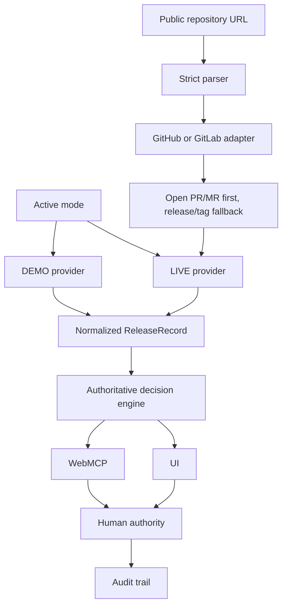

# Release Gate

Agent-native software release decisions with human control.

Release Gate exposes software-release evidence and controlled release decisions to browser agents through WebMCP. In LIVE mode, its primary question is now: “Can this change safely merge?” The system computes deterministic recommendations from CI, tests, dependency security, and change-risk evidence while preserving explicit human authority over final decisions.

## Evidence modes

Release Gate has exactly two explicit evidence modes:

### LIVE

Real read-only evidence from public repositories on exactly two hosts:

- `github.com`
- `gitlab.com`

The dashboard starts with the existing safe default public GitHub source, `https://github.com/JankoD84/release-gate`, and can switch to another public GitHub or GitLab repository by URL. No credentials are required for public repository mode, and this version does not support private repositories, OAuth, user-entered tokens, GitHub Apps, GitLab applications, webhooks, background synchronization, or deployment execution.

LIVE discovery uses provider adapters under a provider-neutral Release Gate surface. Open pull/merge requests are preferred release candidates; releases/tags remain a fallback when no open candidate exists:

- GitHub: public repository metadata, open Pull Requests, PR head SHA, PR changed files/additions/deletions, GitHub Actions workflow runs for the head SHA when anonymously available, then GitHub Releases and fallback tags.
- GitLab: public project metadata, open Merge Requests including nested namespaces, MR head SHA, MR change data, MR/head pipeline evidence when anonymously available, then GitLab Releases and fallback tags.

Provider-specific evidence availability can vary. Missing evidence is never treated as `PASS`: unavailable CI, automated test, or security evidence is represented explicitly as `NOT_AVAILABLE` and drives the existing `CONDITIONAL_GO` warning pathway. Release Gate does not infer test success from CI success and does not infer security status from repository metadata.

Where provider data includes repository-facing evidence links, Release Gate attaches provider-neutral provenance metadata. Examples include GitHub Pull Requests, GitHub Actions workflow runs, GitHub PR/change pages, GitLab Merge Requests, GitLab pipelines, GitLab MR/change pages, and release/tag fallbacks. Provenance links are constrained to HTTPS `github.com` or `gitlab.com` URLs and unsafe or unrelated hosts are omitted.

The default Release Gate repository still uses its published GitHub Actions evidence asset when available. Other public repositories use normalized public provider evidence. If LIVE evidence is unavailable or invalid, Release Gate shows a typed error and does not silently fall back to DEMO.

LIVE change components are derived deterministically from paths: `src/app` and `src/components` → `web`, `src/lib/webmcp` → `agent-interface`, `src/lib/decision` and `src/lib/decisions` → `release-orchestration`, `src/lib/releases` → `release-data`, `.github` → `ci`, Markdown/documentation files → `docs`, and remaining files → `other`.

### DEMO

Deterministic safety scenarios for demonstration:

| Version | Release ID | Recommendation | Risk | Evidence summary |
| --- | --- | --- | --- | --- |
| `2.4.0` | `release-240` | `GO` | `LOW` | Passing CI, passing tests, passing security gate, low change risk. |
| `2.5.0` | `release-250` | `CONDITIONAL_GO` | `MEDIUM` | Passing CI with flaky tests, one medium security finding, payment-sensitive medium-risk changes. |
| `2.6.0` | `release-260` | `NO_GO` | `HIGH` | Failed CI, failed tests, high-severity security findings, broad high-risk changes. |

DEMO mode always works locally without internet access.

## Why Release Gate

Software release decisions are fragmented across CI, automated tests, security findings, change risk, and human judgment. Agents can inspect this information, but production release authority should not silently become agent authority.

Release Gate demonstrates an agent-native release decision workflow:

```text
Real Public Repository → Verifiable Evidence → WebMCP Agent Investigation → Deterministic Recommendation → Required Actions → Human Authority → Auditable Decision → Portable Decision Packet
```

## WebMCP

Release Gate exposes one fixed browser-native WebMCP tool catalog. The same 11 tools operate against whichever mode and public repository are currently active in the application. Provider details are normalized below Release Gate; agents do not need GitHub-specific or GitLab-specific tools. Switching modes or repositories does not register another catalog and does not add a tool parameter.

Discovery:

- `list_releases`
- `get_release`

Evidence:

- `get_ci_status`
- `get_test_results`
- `get_security_findings`
- `get_change_risk`

Intelligence:

- `analyze_release`

Human decision:

- `approve_release`
- `reject_release`
- `get_final_decision`

Audit:

- `get_activity_log`

The catalog contains exactly 11 tools: 9 read-only tools and 2 write tools. The input schemas are unchanged. Relevant read outputs include additive repository, candidate, and provenance metadata; `analyze_release` includes deterministic Required Actions so agents can explain both “what is the recommendation?” and “where did this evidence come from?” without new tools.

## Safety model

- `analyze_release` is read-only.
- `approve_release` and `reject_release` are explicit write operations.
- `approve_release` requires explicit human acknowledgement.
- `NO_GO` cannot be overridden by approval.
- System Recommendation remains separate from Human Final Decision.
- Required Actions are deterministic output derived from current blockers/warnings; they do not change recommendation rules.
- Unknown LIVE or DEMO release/candidate IDs return `RELEASE_NOT_FOUND` instead of mutating state.
- Switching public repositories clears browser-local decisions and activity to avoid mixing evidence between repositories.
- Write operations are reflected in the activity audit trail.

## Required Actions and Decision Packet

Every analysis includes deterministic Required Actions. Clean `GO` candidates show `None — current evidence does not require remediation.` Blocked candidates map blockers to actions such as `FIX_CI`, `FIX_TESTS`, and `FIX_SECURITY`. Conditional candidates map warnings to actions such as `VERIFY_CI_EVIDENCE`, `VERIFY_TEST_EVIDENCE`, `VERIFY_SECURITY_EVIDENCE`, `INVESTIGATE_FLAKY_TESTS`, `REVIEW_CHANGE_SURFACE`, and `REVIEW_CRITICAL_COMPONENT`. Candidate type does not change action semantics.

The release detail page can create a browser-local Release Decision Packet in two formats:

- Copy Markdown for PR/MR discussion, release notes, Slack/email, or engineering handoff.
- Download JSON for a deterministic structured artifact.

The packet includes repository identity, candidate type/number/title/source branch/target branch/head SHA/provider URL when applicable, release identity, system recommendation, confidence, evidence summaries, provenance when available, Required Actions, Human Final Decision, and a short activity summary. It is not signed, is not uploaded, and does not call a backend.

Release Gate records merge-readiness/release-governance authorization. It does not approve GitHub PR reviews, merge GitHub PRs, approve GitLab MRs, merge GitLab MRs, trigger pipelines, or deploy production.

## Agent Playbook

The Agent Interface includes four provider-neutral copyable prompts focused on merge-readiness review, candidate comparison, governed authorization, and blocker investigation. They work for both GitHub and GitLab candidates; Release Gate does not include a chatbot or LLM execution API.

## LIVE evidence distribution

`.github/workflows/release-evidence.yml` runs on pushes to `main` and `workflow_dispatch`.

The workflow runs:

```bash
npm ci
npm run test
npm run lint
npm run build
npm audit --json
```

It also collects Git file and line-change statistics. Evidence is produced even when tests, lint, build, or audit fail, because failed gates are exactly when Release Gate needs evidence.

The workflow publishes a public GitHub Release asset:

- Release tag: `live-evidence`
- Asset: `release-gate-evidence.json`

The app fetches this public asset server-side through `GET /api/live-evidence`, validates it strictly, and returns only normalized safe evidence. For other selected public repositories, the same route constructs official GitHub or GitLab API URLs from the validated repository identity. It never proxies arbitrary user-supplied URLs. No browser GitHub/GitLab token is required, and no provider token is stored in Vercel.

## Bootstrap process

After this implementation is pushed to `main`:

1. GitHub Actions runs `release-evidence`.
2. The workflow creates or updates the public `live-evidence` release.
3. The `release-gate-evidence.json` asset is uploaded/replaced.
4. Production `/api/live-evidence` starts returning LIVE evidence for the current commit.

Before that asset exists, LIVE mode shows `LIVE_EVIDENCE_UNAVAILABLE`. Switch to DEMO to explore deterministic scenarios.

## Architecture



There is one authoritative deterministic decision engine for normalized evidence. Provider adapters collect and normalize evidence only; they do not decide `GO`, `CONDITIONAL_GO`, or `NO_GO`.

### Architecture guardrail

Release Gate is an agent-native release control layer, not a complete release decision intelligence platform. Its built-in deterministic engine and GitHub evidence provider make this hackathon project independently runnable. The provider boundary is designed so a future upstream system could supply authoritative release intelligence—release identity, normalized evidence, recommendation, risk, blockers, warnings, conditions, and policy outcome—without changing the WebMCP governance and human-control layer.

## Local development

Install dependencies:

```bash
npm install
```

Start the development server:

```bash
npm run dev
```

Open the local URL printed by Next.js. By default this is usually:

```text
http://localhost:3000
```

## Quality gates

Run:

```bash
npm run test
npm run lint
npm run build
```

## Browser requirements

The Release Gate UI runs as a Next.js browser application. WebMCP tool registration requires a WebMCP-compatible browser/runtime, such as the Chrome-based WebMCP development environment used by challenge tooling.

In a standard browser without WebMCP support, the UI can still be viewed, but browser-agent tool capabilities are not exposed by the runtime.

## Project status

Hackathon / reference implementation. LIVE mode intentionally supports only public repositories on `github.com` and `gitlab.com`. Private repositories and arbitrary/self-hosted repository hosts are not supported in this version.

## Additional documentation

- [OpenAI WebMCP Challenge notes](HACKATHON.md)
- [Agent evaluation scenarios](AGENT_EVALS.md)
- [Demo script](DEMO.md)

## License

Released under the [MIT License](LICENSE).
